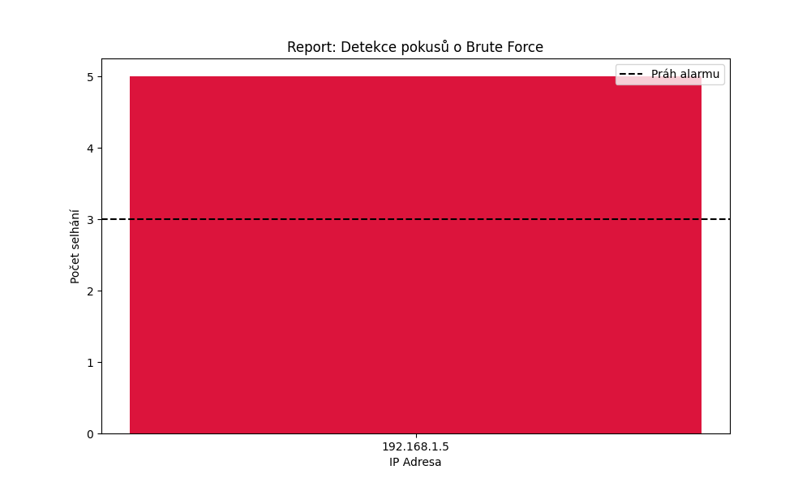

# Security Log Analyzer

Tento nástroj v Pythonu analyzuje serverové logy a detekuje potenciální bezpečnostní hrozby.

## Ukázka výstupu
Zde je grafický report vygenerovaný skriptem `analyzer.py`:



## Jak spustit
1. Ujistěte se, že máte v adresáři soubor `server_logs.txt`.
2. Spusťte skript:
   ```bash
   python analyzer.py

## Funkce detekce hrozeb
Tento nástroj aktuálně identifikuje následující bezpečnostní incidenty v souboru `server_logs.txt`:

* **Brute Force Detection**: Identifikuje IP adresy s více než 3 neúspěšnými pokusy o přihlášení v krátkém časovém úseku.
* **Threshold Alerting**: Automaticky vykresluje červenou zónu v grafu, pokud počet selhání překročí nastavený práh (Práh alarmu).
* **IP Intelligence**: Seznam podezřelých IP adres je exportován pro další analýzu nebo blokování na firewallu.
